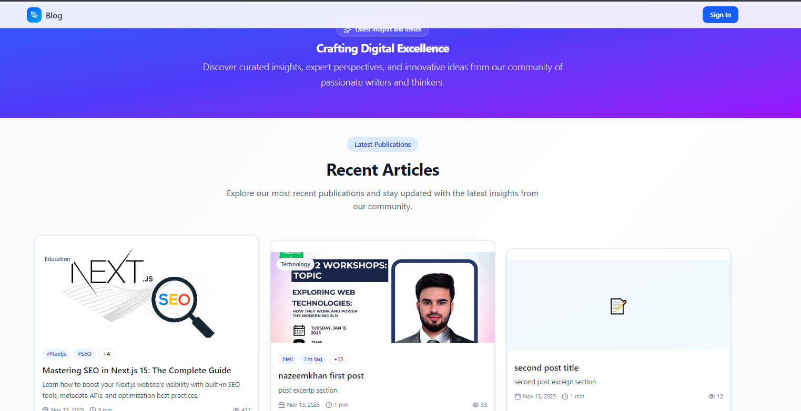
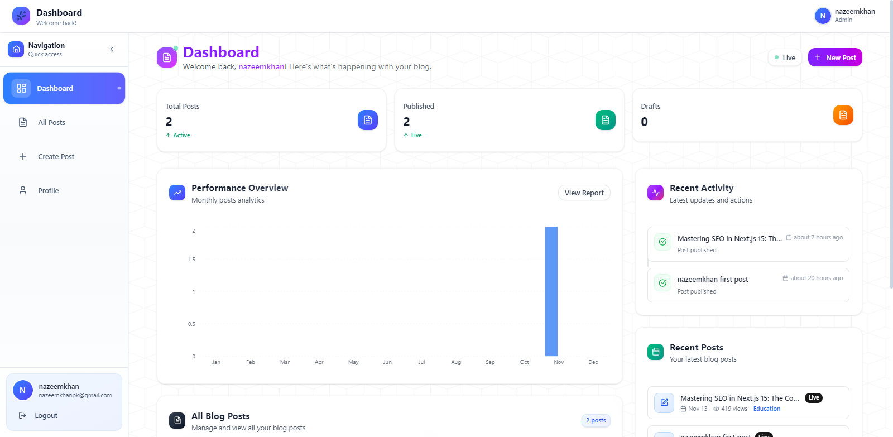
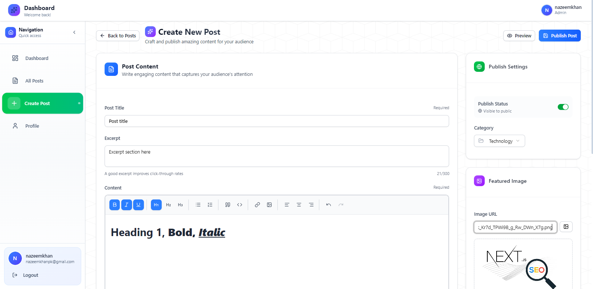
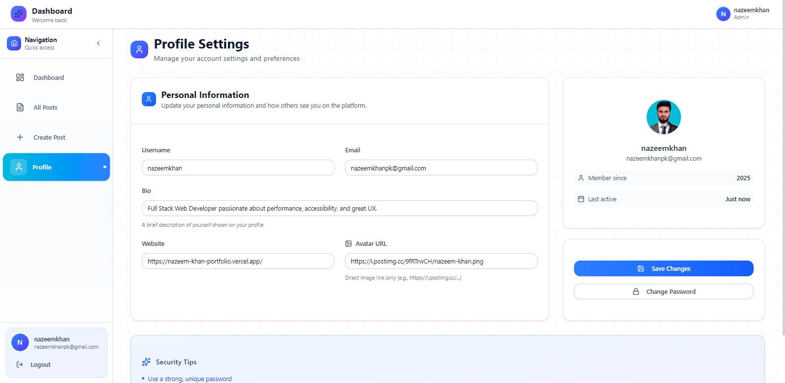

#Modern Blog Creation & Management Platform

A full-stack blogging platform built with **Next.js 16**, **MongoDB**, **JWT Authentication**, **Tailwind CSS**, and **shadcn/ui**. Users can write, edit, publish, and manage blogs through a clean dashboard, while visitors enjoy a fast, modern reading experience.

Inkforge includes SEO-friendly slugs, secure authentication, password reset via Gmail, profile management, a TipTap editor, protected API routes, and rate limiting via Upstash Redis.

---

## Tech Stack

| Technology    | Purpose             |
| ------------- | ------------------- |
| Next.js 16    | Frontend & SSR      |
| MongoDB       | Database            |
| JWT           | Authentication      |
| Tailwind CSS  | Styling             |
| shadcn/ui     | UI Components       |
| TipTap        | Rich Text Editor    |
| Nodemailer    | Email notifications |
| Upstash Redis | Rate Limiting       |

---

## Features

<details>
<summary><strong>Authentication & Security</strong></summary>

* JWT authentication with `jose`
* Zod validation for backend input safety
* Password hashing with `bcryptjs`
* Full forgot-password flow using Nodemailer (Gmail App Password)
* Reset token expires in 1 hour
* Protected dashboard routes via middleware
* Rate limiting with Upstash Redis

</details>

<details>
<summary><strong>Blog System</strong></summary>

* Create, edit, publish, delete posts
* TipTap rich text editor with images, headings, code blocks, links, formatting
* SEO-friendly slugs
* Views counter
* Featured image (URL-based)
* Categories & tags support

</details>

<details>
<summary><strong>Public Website</strong></summary>

* Homepage `/` displays all published posts
* SEO metadata (Open Graph + Twitter embeds)
* Public blog detail `/blog/:slug`
* Public user profile `/user/:id` with their posts

</details>

<details>
<summary><strong>Dashboard</strong></summary>

* `/dashboard` with user stats (Recharts)
* `/dashboard/posts` for listing posts
* `/dashboard/create` to create posts
* `/dashboard/edit/:id` to edit posts
* Profile page: update username, email, password, profile image

</details>

<details>
<summary><strong>UI/UX</strong></summary>

* shadcn/ui components
* Radix UI primitives
* Responsive grid layout
* Tailwind CSS with modern animations
* Clean typography and modern design

</details>

---

## Rate Limiting (Upstash Redis)

| Feature         | Limit                                    |
| --------------- | ---------------------------------------- |
| Forgot Password | 3 requests per 10 minutes per IP + email |
| Login           | 5 requests per minute per IP + email     |
| Register        | 3 requests per 10 minutes per IP + email |
| Change Password | 5 requests per hour per IP + user        |
| Delete Account  | 1 request per hour per IP + user         |
| Reset Password  | 3 requests per hour per IP + token       |
| General API     | 60 requests per minute per IP            |
| Post Creation   | 10 posts per minute per IP + user        |
| Auth Check      | 60 requests per minute per IP            |

---

## Project Structure

```
my-blog-app/
│
├── app/
│   ├── (public)/blog/[slug]/page.jsx
│   ├── (public)/user/[id]/page.jsx
│   ├── auth/login/page.jsx
│   ├── auth/register/page.jsx
│   ├── auth/reset-password/page.jsx
│   ├── dashboard/page.jsx
│   ├── dashboard/posts/page.jsx
│   ├── dashboard/create/page.jsx
│   ├── dashboard/edit/[id]/page.jsx
│   └── api/
│       ├── auth/{login,register,forgot,reset}/route.js
│       ├── posts/{route.js,[id]/route.js}
│       └── users/[id]/route.js
│
├── components/          # UI, editor, layout components
├── lib/                 # DB, JWT, mail, validators
├── models/              # User, Post, Token
└── utils/               # Sanitization, date utils
```

---

## Installation & Setup

### 1. Clone Repository

```bash
git clone https://github.com/yourname/inkforge.git
cd inkforge
```

### 2. Install Dependencies

```bash
npm install
```

### 3. Create `.env` File

```
MONGO_URI=your_mongodb_uri
JWT_SECRET=your_secret
EMAIL_USER=your_gmail
EMAIL_PASS=your_gmail_app_password
NEXT_PUBLIC_APP_URL=http://localhost:3000
```

### 4. Start Development Server

```bash
npm run dev
```

---

## API Overview

<details>
<summary><strong>Auth Routes</strong></summary>

| Route                | Method | Description       |
| -------------------- | ------ | ----------------- |
| `/api/auth/register` | POST   | Register new user |
| `/api/auth/login`    | POST   | Login user        |
| `/api/auth/forgot`   | POST   | Send reset email  |
| `/api/auth/reset`    | POST   | Reset password    |

</details>

<details>
<summary><strong>Posts Routes</strong></summary>

| Route            | Method | Description             |
| ---------------- | ------ | ----------------------- |
| `/api/posts`     | GET    | Get all published posts |
| `/api/posts`     | POST   | Create post             |
| `/api/posts/:id` | PUT    | Update post             |
| `/api/posts/:id` | DELETE | Delete post             |
| `/blog/:slug`    | GET    | Get post by slug        |

</details>

<details>
<summary><strong>User Routes</strong></summary>

| Route            | Method | Description              |
| ---------------- | ------ | ------------------------ |
| `/api/users/:id` | GET    | Get user profile + posts |

</details>

---

## Authentication Flow

1. User logs in
2. Server signs JWT using `jose`
3. Token stored in HTTP-only cookie
4. Middleware validates token for private routes
5. Logout removes token cookie

---

## Screenshots







---

## Contact

**Developer:** Nazeem Khan
**GitHub:** [https://github.com/naxim-khan](https://github.com/naxim-khan)
**Portfolio:** [https://nazeem-khan-portfolio.vercel.app](https://nazeem-khan-portfolio.vercel.app)
